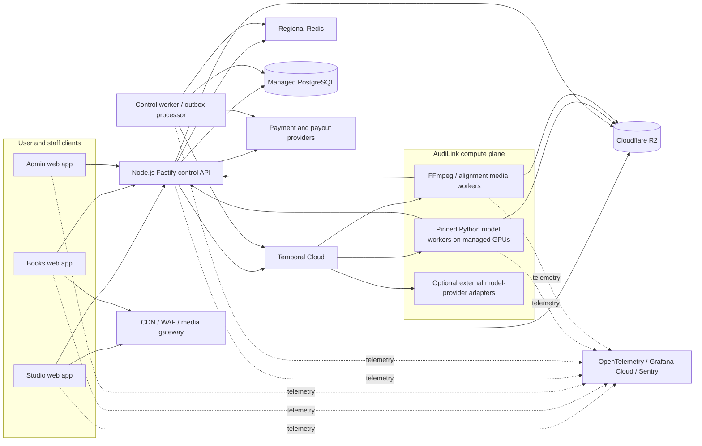
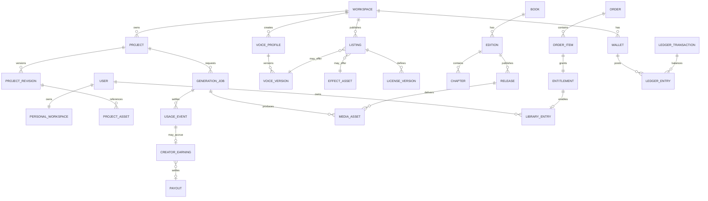
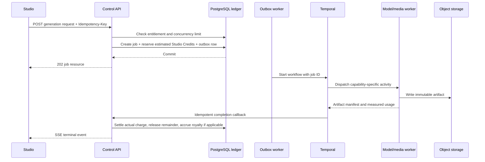

# AudiLink Platform Architecture

**Status:** Approved implementation baseline

**Last updated:** 2026-08-03

**Audience:** Product engineering, ML engineering, infrastructure, security, and operations

## 1. Purpose and architectural principles

AudiLink is one platform with three separately deployed web applications:

- **Studio** — audiobook production, voice creation, text-to-speech, sound-effect generation, and the voice/SFX discovery marketplace.
- **Books** — the audiobook storefront, library, reader/player, and Books-only Reader Coin wallet.
- **Admin** — staff-only operations for moderation, catalog review, model controls, billing support, ledger adjustments, and incident response.

The platform is designed for individual creators and readers first. A personal workspace is created for every account, but all owned records carry a workspace identifier so team workspaces can be added later without changing ownership semantics.

The core design choices are:

1. Use a **modular monolith control plane** for identity, product state, commerce, entitlements, and accounting.
2. Isolate **long-running Python/GPU inference** and **FFmpeg media processing** from request-serving applications.
3. Prefer managed databases, workflow orchestration, object storage, CDN, and observability services.
4. Run core open-weight models in **AudiLink-owned, pinned containers on managed GPU capacity**. External AI providers are optional adapters, never the source of truth.
5. Treat PostgreSQL as the durable system of record. Redis, SSE, search projections, workflow histories, and provider dashboards are derived or operational state.
6. Keep reader currency, creator-generation currency, and fiat liabilities separate:
   - Studio voice and SFX use consumes **Studio Credits**.
   - A standalone SFX download is purchased in **fiat**.
   - **Reader Coins are Books-only** and cannot fund Studio or marketplace activity.
7. Version contracts, project documents, prices, plans, licenses, models, and media manifests from the first release.

Next.js Route Handlers remain a frontend/BFF tool, not the platform backend. The Next.js documentation explicitly notes that its backend features are not a full backend replacement and that some hosts terminate long-running handlers: [Next.js Backend for Frontend](https://nextjs.org/docs/app/guides/backend-for-frontend).

## 2. System context



### 2.1 Trust boundaries

- Browsers communicate only with a public app origin, the public control API, and narrowly scoped object/media endpoints.
- Browsers never receive database credentials, long-lived storage credentials, provider secrets, or model-worker credentials.
- Model and media workers initiate outbound connections to Temporal, object storage, telemetry, and the internal API. They expose no unauthenticated public inference ports.
- Staff actions pass through the same control API and authorization layer as user actions, with additional Admin roles, MFA, and auditing.
- User-generated media is served from a cookie-less registrable domain so shared application session cookies are not sent to untrusted content.

## 3. Repository and runtime topology

The current two Next.js projects will become a single Bun workspace. The target structure is:

```text
apps/
  studio/                 # current audilink app
  books/                  # current audilink-books app
  admin/                  # internal staff application
services/
  control-api/            # Node.js 24 LTS + Fastify
  control-worker/         # outbox, webhook, projection, notification work
  inference/
    common/               # adapter protocol and shared Python utilities
    qwen-tts/
    voicebox-engines/
    fish-speech/
    sfx/
  media-worker/           # FFmpeg, waveform, alignment, packaging
packages/
  ui/                     # primitives and tokens, not whole product screens
  auth/
  contracts/              # OpenAPI schemas and generated clients
  db/                     # Drizzle schema, repositories, migrations
  billing/                # entitlement and ledger domain rules
  config/
  observability/
infra/
docs/
```

Use one root <code>bun.lock</code>, Bun workspaces, and <code>workspace:*</code> dependencies. Bun officially supports monorepo workspaces, dependency deduplication, and filtered scripts: [Bun workspaces](https://bun.sh/docs/pm/workspaces).

Runtime decisions:

| Component | Runtime | Notes |
|---|---|---|
| Studio, Books, Admin | Next.js 16.2 / React 19.2 / TypeScript | Three Vercel projects from one workspace |
| Control API and worker | Node.js 24 LTS / Fastify 5 | Bun remains package manager and task runner |
| ML and media workers | Python 3.11 or model-certified 3.12 | Each image pins Python, CUDA, PyTorch, model code, and weights revision |
| Local tooling | Bun plus uv | Separate lockfiles for JavaScript and Python ecosystems |

Node 24 is the production LTS line as of this document: [Node.js release schedule](https://nodejs.org/en/about/previous-releases). Bun runtime deployment may be evaluated later, but it is not the launch default for the control API.

## 4. Web application boundaries

### 4.1 Studio

Studio owns the creator experience:

- projects, manuscript import, scenes, characters, tracks, and non-destructive editing;
- voice creation and voice-reference management;
- TTS, multi-character audiobook generation, and SFX generation;
- voice/SFX discovery, licenses, and usage;
- Studio plans, Studio Credit wallet, generation history, and exports.

Studio never performs authoritative audio rendering in the browser. Web Audio and AudioWorklet provide low-latency preview; a media worker produces authoritative exports and publication artifacts.

### 4.2 Books

Books owns:

- public audiobook catalog and discovery;
- free and paid acquisition;
- Reader Coin wallet and coin-funded book orders;
- personal library, protected playback, chapter navigation, bookmarks, and listening progress;
- creator/publisher storefront views.

Reader Coins cannot be accepted by Studio endpoints, voice/SFX marketplace endpoints, or Admin adjustment endpoints intended for Studio Credits.

### 4.3 Admin

Admin is a separate deployment and is never bundled into Studio or Books navigation. It provides:

- user, project, listing, book, and voice-consent review;
- model enablement, license gates, benchmark status, and rollout control;
- generation-job inspection, retry/cancel, and artifact quarantine;
- payment, payout, dispute, and webhook inspection;
- append-only ledger corrections through approved compensating transactions;
- moderation, takedowns, audit queries, and support tooling.

Admin requires a staff role plus passkey or TOTP MFA. High-impact actions require recent step-up authentication, an explicit reason, and an audit event. Direct database mutation from Admin is prohibited.

### 4.4 Shared packages

Shared packages contain design primitives, tokens, authentication clients, API contracts, telemetry, and pure domain utilities. They do not merge the three products into one navigation shell or create cross-application imports of page components.

Recommended public origins are <code>studio.&lt;domain&gt;</code>, <code>books.&lt;domain&gt;</code>, <code>admin.&lt;domain&gt;</code>, and <code>api.&lt;domain&gt;</code>. The applications share identity through a trusted parent domain. If product routing later moves to one hostname, Next.js supports multiple separately deployed zones: [Next.js Multi-Zones](https://nextjs.org/docs/app/guides/multi-zones).

## 5. Control-plane architecture

The control plane is one Fastify deployable organized into modules:

- identity and workspaces;
- assets and uploads;
- Studio projects and revisions;
- model catalog, voices, and effects;
- generation jobs and usage metering;
- marketplace catalog and licenses;
- Books catalog, library, and progress;
- plans, entitlements, wallets, and ledger;
- orders, payments, earnings, and payouts;
- moderation, audit, Admin operations, and provider webhooks.

Modules communicate through typed in-process interfaces and domain events. They do not call one another over HTTP. Cross-system side effects use a transactional outbox.

Fastify route schemas use TypeBox/JSON Schema. Fastify recommends schema-based request validation and response serialization, which also limits accidental sensitive-field disclosure: [Fastify validation and serialization](https://fastify.dev/docs/latest/Reference/Validation-and-Serialization/).

### 5.1 Transactional outbox

Any operation that must update PostgreSQL and another system writes its domain records and an outbox row in the same database transaction. The control worker leases outbox rows, executes the side effect, and records completion idempotently.

Outbox event examples:

- <code>generation.requested</code> starts a Temporal workflow;
- <code>catalog.changed</code> updates the search projection and invalidates web caches;
- <code>payment.webhook.accepted</code> applies a verified provider event;
- <code>order.completed</code> grants an entitlement and accrues creator earnings;
- <code>artifact.ready</code> notifies a user and publishes an SSE update.

Outbox rows use exponential retry, a next-attempt timestamp, bounded attempts for non-transient errors, and a dead-letter status visible in Admin.

## 6. Identity, sessions, and authorization

Use Better Auth with its PostgreSQL adapter, mounted by the control API.

- Support email authentication and approved social providers.
- Store sessions in PostgreSQL; do not use stateless bearer tokens as the sole revocation mechanism.
- Enable secure, HTTP-only, SameSite cookies.
- Share cookies only across AudiLink-controlled application subdomains.
- Maintain an explicit trusted-origin allowlist for Studio, Books, and Admin.
- Use a cookie presence check only for optimistic page redirects. Every protected API operation performs authoritative session and authorization checks.
- Provision one personal workspace for every user at signup.
- Model authorization as workspace ownership plus explicit resource/role checks.

Better Auth documents PostgreSQL support, Next.js 16 integration, and cross-subdomain cookie controls: [PostgreSQL adapter](https://better-auth.com/docs/adapters/postgresql), [Next.js integration](https://better-auth.com/docs/integrations/next), and [cookie guidance](https://better-auth.com/docs/concepts/cookies).

### 6.1 Roles

| Scope | Roles |
|---|---|
| Personal workspace | owner |
| Future shared workspace | owner, editor, viewer, billing |
| Marketplace creator | creator status plus listing-level ownership |
| Staff | support, moderator, finance, model-operator, administrator |

Staff roles do not imply workspace membership. Staff reads and mutations use dedicated policy checks and are always audited.

## 7. PostgreSQL and persistence

Use managed PostgreSQL 17 or newer with automated backups, point-in-time recovery, encrypted connections, and separate production/staging clusters.

Use Drizzle for typed queries and checked-in SQL migrations. Drizzle supports reviewable generated SQL plus custom migrations where database-native features are required: [Drizzle migrations](https://orm.drizzle.team/docs/migrations).

### 7.1 Database schemas

| Schema | Primary records |
|---|---|
| auth | users, accounts, sessions, verification |
| core | workspaces, memberships, feature flags, audit actors |
| studio | projects, project revisions, characters, clips, tracks, generated takes |
| media | assets, variants, manifests, upload sessions, waveform data |
| models | model definitions, revisions, capabilities, licenses, benchmarks |
| catalog | voice profiles, voice versions, effects, listings, listing/license versions, books, editions, chapters, releases |
| commerce | orders, order items, entitlements, library entries, listening progress |
| billing | plans, plan versions, subscriptions, usage events, wallets, credit lots, ledger transactions and entries |
| payouts | creator earning lots, payout accounts, transfers, payouts, disputes |
| ops | idempotency keys, webhook inbox, outbox, job projections, moderation cases |

### 7.2 Tenant isolation and RLS

Every tenant-owned record includes <code>workspace_id</code>. PostgreSQL Row-Level Security is enabled on tenant-owned tables.

- A request transaction sets <code>SET LOCAL app.workspace_id</code> after authentication.
- The ordinary API role is subject to RLS.
- Background workers use narrowly scoped service roles and must still state the target workspace for tenant data.
- Finance and Admin queries use explicit privileged repositories and emit audit events.
- Browser clients never connect directly to PostgreSQL.

PostgreSQL documents RLS as a database-enforced row access policy: [PostgreSQL Row Security Policies](https://www.postgresql.org/docs/current/ddl-rowsecurity.html).

### 7.3 Identifiers and common columns

- Use application-generated UUIDv7 identifiers for externally visible records.
- Store timestamps in UTC with time zone.
- Store fiat in signed 64-bit minor units plus ISO 4217 currency.
- Store Studio Credits and Reader Coins as integers, never floating point.
- Include <code>created_at</code>, <code>updated_at</code>, and optimistic <code>version</code> where concurrent editing applies.
- Soft deletion is used only where recovery, audit, or license obligations require it; otherwise deletion is explicit and policy-driven.

## 8. Domain model

### 8.1 Core relationships



### 8.2 Studio project document

Manual editing is non-destructive. A project revision stores a versioned edit-decision document containing:

- manuscript blocks and scene boundaries;
- characters and selected voice versions;
- tracks and clip references;
- source in/out offsets, timeline position, gain, pan, fades, and effect parameters;
- generation take selection;
- chapter markers and export settings.

Media is immutable and referenced by asset ID. Autosave uses a base revision/ETag. A conflicting save returns HTTP 409 with the current revision so the client can reconcile. Publication and export always target a specific immutable revision.

### 8.3 Voice profile and version

A voice profile is the human-facing identity. A voice version is immutable and engine-specific. It records:

- source reference assets and consent/provenance record;
- compatible model family and revision;
- derived embedding/reference manifest;
- language/style metadata;
- moderation and publication status;
- revocation and takedown state.

Embeddings and voice-reference files are private platform assets. Marketplace access grants platform use rights; it does not expose embeddings or raw reference audio by default.

### 8.4 Listing and license version

Voice and SFX listings have immutable price/license versions. Existing entitlements retain the version purchased or accepted.

Launch license modes are:

- **Studio usage license:** permits use inside a Studio project. Each generation/render consumes Studio Credits.
- **Standalone SFX download license:** permits download of the specified SFX deliverable after a fiat order.
- **Free license:** still creates an entitlement and records the accepted license version.

Reader Coins are not accepted for voice or SFX licenses.

### 8.5 Book release

A book release points to:

- an immutable edition and chapter manifest;
- cover and catalog metadata;
- protected streaming artifacts;
- protected offline-delivery artifact, never a raw paid-file download;
- Free or Reader Coin price version;
- publication/moderation state.

Changing audio or chapter ordering creates a new release; it does not overwrite an artifact already owned by readers.

## 9. Wallets, entitlements, and double-entry ledgers

All balances are derived from immutable double-entry ledger entries. A ledger transaction must sum to zero within one currency/unit.

### 9.1 Separate units and liabilities

| Unit/account family | Allowed use | Cash redemption |
|---|---|---|
| Studio Credits | Voice use, TTS, audiobook generation, in-app SFX use, eligible media processing | Never |
| Reader Coins | Books catalog purchases only | Never |
| Fiat customer payments | Plans, Studio Credit packs, Reader Coin packs, standalone SFX downloads | Provider refund rules |
| Creator earnings by ISO currency | Voice/SFX/book royalties and sale proceeds | Paid through payout provider |

No endpoint may exchange Reader Coins for Studio Credits, exchange either unit for cash, or pay creator withdrawals from those virtual-unit wallets.

### 9.2 Studio Credit reservation and settlement



Rules:

- A generation job cannot be dispatched without a committed reservation.
- The estimate uses a versioned rate card and an upper-bound duration/character calculation.
- Successful completion settles measured billable usage.
- Failure before a usable artifact releases the full reservation.
- Partial completion follows the product refund policy encoded in the rate-card version; the settlement is never inferred from mutable current pricing.
- Duplicate callbacks or retries reuse the same settlement idempotency key.
- When a marketplace voice or SFX is used, the usage event records the listing/license version. Any creator royalty is accrued as a separate fiat creator-earnings entry, not as Studio Credits.

### 9.3 Reader Coin order

A Reader Coin book order:

1. locks/checks the Reader Coin wallet;
2. posts an immutable coin-spend ledger transaction;
3. creates the order and entitlement in the same database transaction;
4. records any fiat-denominated creator royalty according to the book price/revenue-share version;
5. creates a library entry.

Promotional and purchased coin lots remain distinguishable for expiry/refund policy. Reader Coin balances are never used to calculate creator cash withdrawal directly.

### 9.4 Plans and feature limits

Plans are immutable versions containing:

- monthly Studio Credit grant;
- purchased-credit eligibility;
- permitted models/features;
- maximum project/book length;
- concurrent interactive and batch job limits;
- export formats and quality;
- storage and retention limits;
- marketplace publishing eligibility.

The entitlement service evaluates plan version plus account overrides before any metered operation. Usage events are append-only and can rebuild monthly counters.

## 10. Application API conventions and surface

These endpoints are versioned contracts for AudiLink's own applications and workers. They are not a supported public developer API in V1.

### 10.1 Contract conventions

- REST under <code>/v1</code>; no GraphQL or tRPC boundary.
- OpenAPI 3.1 is generated from Fastify route schemas and committed as a build artifact.
- Both web apps and Admin use generated TypeScript clients.
- JSON uses camelCase externally and a consistent mapping layer to database columns.
- Errors use RFC 9457 <code>application/problem+json</code> with stable <code>type</code>, <code>code</code>, <code>status</code>, <code>detail</code>, and <code>requestId</code>.
- Collections use opaque cursor pagination.
- Every mutation returns the canonical resource or an asynchronous job resource.
- Generation, order, wallet, refund, transfer, payout, and upload-finalization mutations require <code>Idempotency-Key</code>.
- The idempotency table keys on actor, route operation, and key; reuse with a different request hash returns HTTP 409.

### 10.2 Surface by module

| Module | Representative routes |
|---|---|
| Auth | <code>/auth/*</code>, <code>/v1/me</code>, <code>/v1/sessions</code> |
| Workspaces | <code>/v1/workspaces</code>, <code>/v1/workspaces/{id}</code> |
| Uploads/assets | <code>/v1/uploads</code>, <code>/v1/uploads/{id}/complete</code>, <code>/v1/assets/{id}</code> |
| Projects | <code>/v1/projects</code>, <code>/v1/projects/{id}/revisions</code>, <code>/v1/projects/{id}/exports</code> |
| Voices | <code>/v1/voices</code>, <code>/v1/voices/{id}/versions</code>, <code>/v1/voices/{id}/consent</code> |
| SFX | <code>/v1/effects</code>, <code>/v1/effects/generations</code> |
| Generation | <code>/v1/generation-jobs</code>, <code>/v1/generation-jobs/{id}</code>, <code>/v1/generation-jobs/{id}/cancel</code> |
| Events | <code>/v1/events/jobs/{jobId}</code> |
| Marketplace | <code>/v1/marketplace/listings</code>, <code>/v1/marketplace/listings/{id}</code>, <code>/v1/marketplace/licenses</code> |
| Books | <code>/v1/books</code>, <code>/v1/releases/{id}</code>, <code>/v1/library</code>, <code>/v1/listening-progress</code> |
| Billing | <code>/v1/plans</code>, <code>/v1/subscriptions</code>, <code>/v1/wallets</code>, <code>/v1/usage</code> |
| Commerce | <code>/v1/orders</code>, <code>/v1/checkouts</code>, <code>/v1/entitlements</code> |
| Creator finance | <code>/v1/creator/earnings</code>, <code>/v1/creator/payout-account</code>, <code>/v1/creator/payouts</code> |
| Provider webhooks | <code>/webhooks/payments/{provider}</code>, <code>/webhooks/payouts/{provider}</code> |
| Admin | <code>/v1/admin/*</code> with staff authorization and audit requirements |

### 10.3 Generation-job state machine

Canonical states are:

<code>queued → dispatching → running → postProcessing → succeeded</code>

Terminal alternatives are <code>failed</code> and <code>cancelled</code>. A retry creates another attempt under the same logical job; it does not create another credit reservation.

Job resources expose:

- logical job ID and current attempt;
- capability/model revision;
- progress stage and completed/total units;
- estimated and settled Studio Credits;
- terminal error code safe for the user;
- output asset IDs;
- timestamps.

### 10.4 SSE

The job event endpoint emits:

- <code>snapshot</code> — authoritative current state on connect;
- <code>progress</code> — throttled stage/counter changes;
- <code>artifact</code> — a usable preview or final artifact;
- <code>terminal</code> — success, failure, or cancellation;
- <code>heartbeat</code> — keeps intermediaries and clients aware of liveness.

Events carry monotonic IDs. Clients reconnect with <code>Last-Event-ID</code>. Redis provides live fan-out, but the API always rebuilds the initial snapshot from PostgreSQL, so Redis loss cannot lose job state.

## 11. Upload, ingest, and media delivery

Cloudflare R2 is the launch object store behind an S3-compatible storage interface. R2 is strongly consistent and S3-compatible: [How R2 works](https://developers.cloudflare.com/r2/how-r2-works/).

### 11.1 Storage classes

| Bucket/prefix | Contents | Access |
|---|---|---|
| private-originals | manuscripts, uploads, raw voice references | private |
| private-derived | generated clips, stems, editor proxies | private |
| public-previews | watermarked marketplace/book previews and public covers | CDN public |
| protected-delivery | entitled-book HLS and encrypted, app-managed offline packages | token-gated CDN |
| quarantine-temp | incomplete, failed, suspicious, or pending-scan objects | service-only with lifecycle expiry |

### 11.2 Upload flow

1. Client creates an upload session with declared type, size, checksum, and purpose.
2. API validates plan limits and issues a short-lived presigned PUT or multipart credential scoped to one opaque key.
3. Client uploads directly to R2.
4. Client finalizes the upload with part/checksum data and an idempotency key.
5. API records the pending asset and enqueues ingest through the outbox.
6. A media worker probes the file in a sandbox, verifies MIME/container/duration, scans it, strips unsafe metadata, and creates the canonical master plus proxy/waveform variants.
7. The asset becomes ready only after immutable variants and their checksums are recorded.

R2 recommends presigned URLs for direct browser access and multipart upload for large/resumable files: [R2 presigned URLs](https://developers.cloudflare.com/r2/api/s3/presigned-urls/) and [upload objects](https://developers.cloudflare.com/r2/objects/upload-objects/).

Presigned URLs are bearer tokens and work on the R2 S3 API endpoint, not a custom domain. Protected playback therefore uses a media gateway rather than exposing a long-lived presigned custom-domain URL.

### 11.3 Playback flow

1. Books requests a playback session for a release.
2. API checks the current entitlement, account state, release availability, and territory rules.
3. API returns a short-lived media token scoped to user, release, asset prefix, and expiry.
4. A Cloudflare Worker on the cookie-less media domain validates the token and serves R2 objects through a binding.
5. HLS segments and permitted byte ranges are cached according to the protected-delivery policy.
6. Books posts throttled listening progress with edition, chapter, position, and client timestamp.

Progress updates are monotonic per listening session and idempotent. Playback never proxies full audio through the Node control API.

### 11.4 Canonical formats

- Voice/generated clip master: PCM WAV, 48 kHz, 24-bit, mono.
- SFX/music master: PCM WAV, 48 kHz, 24-bit, stereo where appropriate.
- Editor proxy: AAC-LC in M4A/MP4 plus waveform-peaks JSON.
- Book streaming: chapterized HLS using AAC-LC/fMP4.
- Creator export: M4B with chapters and optional MP3 compatibility export. Reader offline access uses an encrypted, app-managed package rather than an exposed export file.
- Final normalization baseline: two-pass <code>-18 LUFS</code> integrated and <code>-1 dBTP</code>; a publication profile may override this with a versioned mastering preset.

FFmpeg documents HLS muxing and EBU R128 loudness normalization: [FFmpeg formats](https://ffmpeg.org/ffmpeg-formats.html) and [FFmpeg loudnorm](https://ffmpeg.org/ffmpeg-filters.html).

## 12. Workflow and inference plane

Use Temporal Cloud for durable workflows. Temporal task queues persist work, are polled by workers with spare capacity, and route work without inbound worker discovery: [Temporal Task Queues](https://docs.temporal.io/task-queue). Temporal also provides declarative activity retry policies: [Temporal Retry Policies](https://docs.temporal.io/encyclopedia/retry-policies).

### 12.1 Queue topology

Separate queues by capability and latency class:

- interactive TTS by primary model family;
- batch TTS/audiobook by model family;
- voice embedding/preparation;
- SFX generation;
- alignment/transcription;
- CPU post-processing and export;
- publication packaging.

Interactive queues never share backlog with full-book batch jobs. Each GPU worker declares a bounded concurrency consistent with its memory profile; normally one heavy model activity occupies one GPU slot.

### 12.2 Workflow rules

- Workflow IDs equal logical generation/export/publication job IDs.
- An outbox dispatcher starts workflows idempotently.
- Workflow payloads contain opaque IDs and immutable revision identifiers, not manuscript text, voice audio, payment data, or presigned URLs.
- All network, database, model, and storage calls occur in activities, not deterministic workflow code.
- Activities heartbeat stage/progress and check cancellation between chunks.
- Retried activities use deterministic output keys and completion idempotency keys.
- A final control-API callback settles credits and records artifacts once.

### 12.3 Audiobook workflow

A full-book workflow may:

1. validate the immutable project revision;
2. parse scenes/segments and resolve character-to-voice-version bindings;
3. create child segment workflows in bounded batches;
4. generate and align takes;
5. apply project effects and silence/crossfade rules;
6. assemble chapters;
7. loudness-normalize and quality-check;
8. generate editor previews, HLS, M4B, and requested exports;
9. publish an artifact manifest or return the export to Studio.

A failed segment can be regenerated without replaying completed immutable segments. A changed project revision starts a new workflow and may reuse content-addressed artifacts when the inputs, model revision, seed, and render settings are identical.

### 12.4 Model adapter contract

Every model worker implements one internal contract:

**Request**

- job, workspace, and project revision IDs;
- model family and immutable model revision;
- text/segment asset reference;
- voice-version or reference-asset ID;
- language, seed, and supported controls;
- output specification and trace context.

**Result**

- object key and SHA-256;
- duration, sample rate, channel count, and format;
- alignment/timestamp asset where supported;
- loudness and peak measurements;
- model revision, container digest, and inference parameters;
- safety/provenance flags and measured billable units.

Raw audio is never returned through Temporal or the control API.

### 12.5 Model registry and deployment

The model registry records:

- model family and exact upstream revision/hash;
- AudiLink image digest and CUDA/PyTorch/runtime versions;
- supported capabilities, languages, controls, sample rate, and context limits;
- minimum VRAM/hardware class and expected real-time factor;
- code and weight licenses, attribution, and commercial approval;
- benchmark suite/version, rollout status, and billing rate-card version.

AudiLink core models run in AudiLink-owned containers on managed GPU infrastructure. Images are built and scanned in CI, weights are pinned and checksum-verified, and model downloads never occur in a request path.

An <code>InferenceProvider</code> adapter may call an approved external model API for burst capacity or a capability not yet self-hosted. Provider output must still return the same artifact manifest, usage, provenance, moderation, and idempotency semantics. Provider fallback is opt-in per model/capability; it may not silently send private voice data to a third party.

Voicebox is MIT licensed and provides a useful implementation reference for its supported Qwen3-TTS, Qwen CustomVoice, LuxTTS, Chatterbox, TADA, and Kokoro engines: [Voicebox repository](https://github.com/jamiepine/voicebox) and [Voicebox license](https://github.com/jamiepine/voicebox/blob/main/LICENSE). Its desktop/local server is not deployed as the multi-tenant control plane; reusable engine code is isolated behind AudiLink adapters.

Qwen3-TTS is Apache-2.0: [official Qwen3-TTS repository](https://github.com/QwenLM/Qwen3-TTS). Fish S2 Pro is gated off in paid production until AudiLink has a separate commercial agreement because its published research license does not grant commercial hosted-service rights: [Fish S2 Pro model card](https://huggingface.co/fishaudio/s2-pro) and [Fish Audio license](https://huggingface.co/fishaudio/s2-pro/blob/main/LICENSE.md).

## 13. Search

Launch search uses PostgreSQL rather than a separate search cluster.

- Maintain typed search-projection rows for books, voices, and effects.
- Use weighted English <code>tsvector</code> fields for title, description, creator, narrator, and tags.
- Use GIN indexes for full-text search.
- Use <code>pg_trgm</code> indexes for typo-tolerant title/name matching.
- Use ordinary indexed columns/joins for language, category, price/license, duration, style, model compatibility, and publication state.
- Update projections through outbox events.
- Never include private manuscript text in a public search projection.

PostgreSQL provides full-text parsing/ranking and indexed trigram similarity: [full-text search controls](https://www.postgresql.org/docs/current/textsearch-controls.html) and [pg_trgm](https://www.postgresql.org/docs/current/pgtrgm.html).

The control API hides the implementation behind a search service interface. A dedicated Typesense/OpenSearch implementation is introduced only after measured catalog scale, relevance needs, or latency exceed the PostgreSQL design.

## 14. Payments, orders, earnings, and payouts

The operating legal entity and launch payout countries are not yet decided. Payment-provider selection therefore remains configuration, while AudiLink commerce and accounting remain provider-neutral.

### 14.1 Provider interfaces

**PaymentsProvider**

- create checkout;
- retrieve/verify payment;
- refund;
- verify and normalize webhook.

**SubscriptionsProvider**

- create subscription;
- change/cancel plan;
- retrieve billing state;
- verify and normalize webhook.

**PayoutsProvider**

- onboard creator/payee;
- retrieve requirements/capabilities;
- create transfer/payout;
- retrieve status;
- verify and normalize webhook.

Initial adapter candidates are Stripe Checkout/Billing/Connect where the platform entity is eligible and Paystack where Ghana/local African payment methods and transfers are required. Stripe documents material regional restrictions for Connect cross-border payouts: [Stripe cross-border payouts](https://docs.stripe.com/connect/cross-border-payouts). Paystack documents split payments and transfers in Ghana: [Paystack split payments](https://paystack.com/docs/payments/split-payments/) and [Paystack transfers](https://paystack.com/docs/transfers/).

No provider balance is treated as AudiLink's ledger. Provider IDs and states are reconciled into internal orders, clearing accounts, earnings, and payouts.

### 14.2 Webhook inbox

Webhook handling:

1. read the raw body;
2. verify provider signature and endpoint secret;
3. insert an immutable inbox row keyed by provider and event ID;
4. return success quickly;
5. process asynchronously and idempotently;
6. fetch current provider state when an event may be stale or out of order;
7. post internal ledger/order changes once;
8. record processing outcome and retry transient failures.

Checkout redirects never grant an entitlement. Only verified provider state does.

### 14.3 Purchase instruments

| Product/action | Allowed instrument |
|---|---|
| Studio plan or Studio Credit pack | Fiat |
| In-app voice generation/use | Studio Credits |
| In-app SFX generation/use | Studio Credits |
| Standalone SFX download | Fiat |
| Free book | Free entitlement transaction |
| Paid book | Reader Coins only |
| Creator payout | Fiat payout provider only |

Tax and seller-of-record responsibility must be finalized with the operating entity. Stripe notes that marketplace tax liability depends on the business model and jurisdiction rather than the API integration alone: [Stripe Tax with Connect](https://docs.stripe.com/tax/connect).

### 14.4 Earnings lifecycle

Creator earnings move through:

<code>pending → available → payoutPending → paid</code>

Refunds, disputes, chargebacks, and reversals create compensating ledger transactions. They never edit or delete the original sale/earning entries. The configured hold period and provider capability determine when pending earnings become available.

## 15. Redis

Use one managed regional Redis deployment colocated with the control API.

Redis is allowed for:

- rate-limit counters;
- short-lived concurrency leases;
- SSE/pub-sub fan-out;
- short-lived cache entries;
- non-authoritative presence/progress hints.

Redis is prohibited as the source of truth for:

- Studio Credit or Reader Coin balances;
- entitlements;
- order/payment/payout state;
- workflow completion;
- project revisions;
- creator earnings.

Loss or eviction of all Redis data must degrade to higher database/API load and reconnecting event streams, not financial or user-data loss.

## 16. Security, privacy, and responsible voice handling

### 16.1 Application and API security

- TLS everywhere and HSTS on production origins.
- Strict trusted-origin CORS and CSRF/origin validation for cookie-authenticated mutations.
- Content Security Policy, secure headers, and no secrets in browser bundles.
- API request body/field/size limits and per-user/workspace rate limits.
- Authorization at both service/repository and RLS layers.
- Separate database roles for API, migrations, workers, and break-glass operations.
- Secrets in a managed secret/KMS service with rotation.
- Object keys are opaque IDs, never user-supplied paths.
- Presigned credentials are operation-, key-, content-type-, and time-scoped.

### 16.2 Upload and media security

- Validate declared and detected MIME/container types.
- Sandbox FFmpeg/probe execution with CPU, memory, time, and filesystem limits.
- Scan uploads and quarantine failures.
- Strip unsafe/unneeded metadata.
- Reject decompression bombs, pathological durations, and unsupported codecs.
- Never serve a pending/quarantined object through a public or protected-delivery prefix.

### 16.3 Voice consent and provenance

- Voice creation requires an explicit consent/provenance record linked to source assets.
- Public marketplace publication requires moderation and creator verification according to policy.
- Record source, model revision, license, consent version, and generated artifact provenance.
- Takedown disables new generation and public previews immediately; treatment of existing paid licenses follows the accepted license version and legal policy.
- Do not train or fine-tune on user content without a separate explicit opt-in.
- Do not expose source voice samples or embeddings to marketplace users.

### 16.4 Sensitive data handling

- Encrypt voice references and identity/verification records at rest with managed keys.
- Keep payment account/bank details at the payment or payout provider; store only provider references and safe status data.
- Do not put manuscript text, voice audio, presigned URLs, access tokens, or payment details in logs, traces, analytics, or Temporal history.
- Apply retention/deletion policies by asset purpose, license, legal hold, and account request.

## 17. Observability and operations

Use OpenTelemetry for traces and metrics across Next.js, Fastify, Temporal clients/workers, Python, and media workers. Export OTLP to Grafana Cloud. Use Sentry for frontend and backend exception triage.

Next.js supports OpenTelemetry instrumentation through its instrumentation convention: [Next.js OpenTelemetry](https://nextjs.org/docs/app/guides/open-telemetry). OpenTelemetry provides JavaScript and Python SDKs with stable tracing and metrics: [OpenTelemetry language support](https://opentelemetry.io/docs/languages/).

### 17.1 Correlation

Propagate:

- trace ID and request ID;
- actor and workspace IDs, using non-PII identifiers;
- logical job/workflow/attempt IDs;
- model revision and container digest;
- asset IDs/checksums;
- provider/event/order IDs where safe.

### 17.2 Required dashboards and alerts

- API latency, errors, saturation, and database pool health;
- outbox lag, retries, and dead-letter count;
- Temporal schedule-to-start latency and task backlog by capability/tier;
- generation real-time factor, failure/cancel/retry rate, OOM and cold-start rate;
- GPU utilization/VRAM and worker heartbeat;
- media ingest/transcode duration and quality-check failures;
- Studio Credit reservation age and reservation/settlement mismatch;
- double-entry invariant and reconciliation failures;
- webhook lag, duplicate rate, refund/dispute, payout failure/reversal;
- playback start time, token failures, HLS/Range error rate, and CDN cache ratio;
- search p95 latency and zero-result rate.

Logs are structured and redacted. Sampling may reduce successful high-volume traces, but errors, payment/ledger operations, and model-rollout cohorts retain complete traces within policy.

## 18. Deployment topology

### 18.1 Launch deployment

| Component | Launch target |
|---|---|
| Studio, Books, Admin | Three Vercel projects sourced from the Bun monorepo |
| Control API and control worker | Google Cloud Run in the primary region |
| PostgreSQL | Managed PostgreSQL 17+ with PITR in the same primary region |
| Redis | Managed regional Redis in the primary region |
| Workflow | Temporal Cloud |
| Object/media edge | Cloudflare R2, Cloudflare CDN, and a Worker media gateway |
| GPU inference | AudiLink OCI containers on a managed GPU platform, initially one warm primary-model pool plus autoscaled batch pools |
| CPU media | Cloud Run or managed container/VM workers |
| Telemetry | Grafana Cloud OTLP plus Sentry |

Vercel supports multiple projects from a Bun-workspace monorepo: [Vercel monorepos](https://vercel.com/docs/monorepos).

Use one primary write region at launch. Static applications and media delivery are global at the edge; PostgreSQL, Redis writes, API, Temporal namespace, and the primary GPU pools are region-aligned. Multi-region writes are out of scope until measured availability/latency requirements justify their consistency cost.

### 18.2 Environments

- Development: local Docker Compose PostgreSQL, Redis, Temporal dev server, MinIO, and optionally cached local models.
- Preview: app previews may use isolated API mocks or a shared non-production backend; they never connect to production data.
- Staging: independent auth secrets, database, Temporal namespace, buckets/prefixes, provider sandbox accounts, and model rollout channel.
- Production: independent cloud projects/accounts and least-privilege service identities.

The local Hugging Face cache is test infrastructure only. Production must use pinned, license-approved, checksum-verified model artifacts.

### 18.3 Scaling

- Scale API on request concurrency and latency, with at least one warm production instance.
- Scale control workers on outbox/webhook lag.
- Scale CPU media workers on queue backlog and execution time.
- Scale GPU workers by capability-specific Temporal backlog while retaining a warm pool for the default interactive model.
- Do not use Kubernetes at launch. OCI images and infrastructure-as-code preserve a later migration path to Kubernetes/NVIDIA scheduling without changing adapter contracts.

## 19. Migrations and release compatibility

### 19.1 Repository migration

1. Move the two existing Next apps under <code>apps/studio</code> and <code>apps/books</code>.
2. Add <code>apps/admin</code>.
3. Create one root Bun workspace and lockfile.
4. Add shared packages without importing domain page components across apps.
5. Add service and infrastructure directories.

There is currently no backend production data to migrate, so the initial database is a reviewed baseline rather than a data conversion.

### 19.2 Database migrations

- Drizzle generates checked-in SQL; engineers review the SQL and data-loss impact.
- A dedicated CI/CD migration job applies migrations before compatible application rollout.
- Applications and workers never run production migrations at startup.
- Better Auth tables are included in the same migration history rather than migrated independently.
- Use expand/backfill/switch/contract:
  1. add compatible columns/tables/indexes;
  2. deploy dual-read/write code where required;
  3. run resumable backfill;
  4. switch reads and validate;
  5. remove old structures in a later release.
- Large indexes use online/concurrent PostgreSQL techniques when supported.
- Every migration is tested from an empty database and from the previous release snapshot.

### 19.3 Contract and artifact compatibility

- REST breaking changes require a new API version or an additive transition period.
- Generated clients are built against the committed OpenAPI artifact.
- Project documents, media manifests, rate cards, plan versions, price/license versions, and model manifests contain schema versions.
- Model rollouts create new immutable revisions. Existing jobs continue on the revision captured at reservation time.
- Worker versioning/capability queues prevent an old worker from receiving an unsupported payload.

## 20. Failure modes and recovery

| Failure | Required behavior |
|---|---|
| API commits job but Temporal start fails | Outbox retries start with deterministic workflow ID; no duplicate reservation |
| Temporal/worker restarts mid-job | Persisted task retries; activity heartbeat identifies retry point; deterministic object keys prevent duplicate artifacts |
| GPU OOM/model crash | Classify transient vs non-retryable, release/requeue worker capacity, bounded retry, preserve one credit reservation |
| Object written but completion callback fails | Retry callback by job/artifact idempotency key; unreferenced temp objects expire by lifecycle |
| Callback arrives twice | Unique completion/settlement key makes the second call a no-op |
| User cancels | Temporal cancellation propagates; worker checks between chunks; usable partial output and credit settlement follow the captured rate policy |
| Redis unavailable | API reads PostgreSQL snapshots; SSE clients reconnect/poll; financial and job state remain intact |
| SSE connection drops | Client reconnects with Last-Event-ID and receives authoritative snapshot |
| Search projection lags/fails | Catalog records remain canonical; outbox retries; Admin shows projection lag |
| Payment redirect succeeds but webhook is delayed | Order remains pending; no entitlement until verified provider state |
| Duplicate/out-of-order webhook | Inbox deduplicates; processor fetches current provider state before applying transition |
| Payment provider outage | Existing entitlements and free flows continue; new provider-dependent checkout/payout is unavailable without corrupting ledger state |
| Payout fails or reverses | Post compensating earnings/payout entries; return eligible funds to available/pending according to policy |
| Media token/CDN fails | Client refreshes token; entitlement remains in PostgreSQL; no direct public fallback for protected audio |
| Database primary unavailable | Fail closed for mutations; serve only explicitly cache-safe public content; recover through managed HA/PITR procedures |
| Model license revoked or security issue found | Disable revision for new dispatch in registry; preserve audit and existing artifacts according to legal policy; route to approved revision/provider |

### 20.1 Reconciliation jobs

Scheduled reconciliation compares:

- ledger-derived wallet balances to materialized balance caches;
- internal payment/transfer/payout states to provider APIs;
- successful jobs to referenced artifacts and recorded credit settlements;
- protected release manifests to object existence/checksums;
- outbox terminal states to expected projections.

Reconciliation creates incidents and compensating operations; it never silently edits immutable ledger/history rows.

## 21. Required architecture tests

Before production, automated tests must cover:

- fresh database migration and previous-release upgrade;
- cross-subdomain login/logout, CSRF, session revocation, Admin MFA, and trusted origins;
- tenant isolation and RLS policy tests across every tenant-owned module;
- double-entry property tests, concurrent spending, reservation expiry, and duplicate idempotency keys;
- Studio Credits charged for in-app voice/SFX use;
- fiat-only standalone SFX download;
- rejection of Reader Coins outside Books;
- worker crash, heartbeat loss, retry, cancellation, partial completion, and no double charge;
- duplicate/out-of-order payment webhooks, refunds, disputes, failed/reversed transfers and payouts;
- free and Reader Coin book entitlement issuance, with direct fiat book checkout rejected;
- unauthorized media tokens, expiry, range/HLS delivery, and entitlement revocation;
- golden audio fixtures per model revision, format/sample-rate/channel validation, and loudness/peak bounds;
- multi-hour audiobook generation, chapter packaging, HLS, M4B, and export;
- search typo, facet, publication-state, and relevance behavior;
- backup restore, model revision rollback, outbox replay, and reconciliation.

## 22. Deferred decisions that do not change this architecture

The following must be finalized before enabling the affected production feature, but the provider-neutral interfaces and ledgers above remain unchanged:

- operating legal entity and platform country;
- launch buyer, creator-payout, settlement-currency, tax, and seller-of-record coverage;
- final payment/payout adapter routing between Stripe, Paystack, or another approved provider;
- exact coin expiry/refund and creator-revenue-share schedules;
- downloadable-book/offline/DRM policy;
- commercial Fish Audio agreement.

These are legal, commercial, or product-policy decisions. They must be represented as versioned configuration and accepted terms, not hard-coded into provider handlers.
